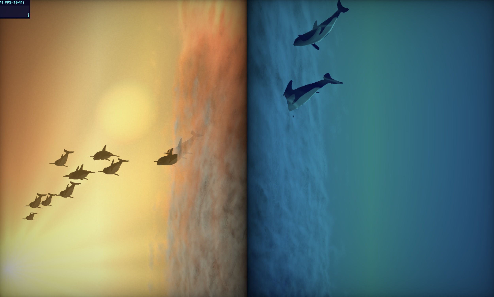

# CIS566 Final Project

Wanru Zhao, Xinyu Lin

Demo: https://wanruzhao.github.io/CIS566FinalProject/

Example
========

Features
=======
- Xinyu Lin
  - Dynamic Movement of Fish
  - Screen Space Ambient Occlusion
  - Water Caustic Effect
  - Flocks
  - Initial camera setting
  
- Wanru Zhao
  - Procudural Cloud : Volumetric rendering, ray marching, noise
  - Split Screen Effect
  - Skybox
  - Sun: Lens flare
  - Effect of fish going through cloud: Combination of screen space info and world space info using depth check
  - Fake DOF: depth fog
  - Environment lighting
  - Background music

Reference
=========
- Background music: 述懐 - S.E.N.S
- Fish Movement: https://www.youtube.com/watch?v=l9NX06mvp2E&t=776s
- Cloud: https://www.shadertoy.com/view/XtS3DD
- Lens: https://www.shadertoy.com/view/4sX3Rs
- SSAO: https://learnopengl.com/Advanced-Lighting/SSAO
